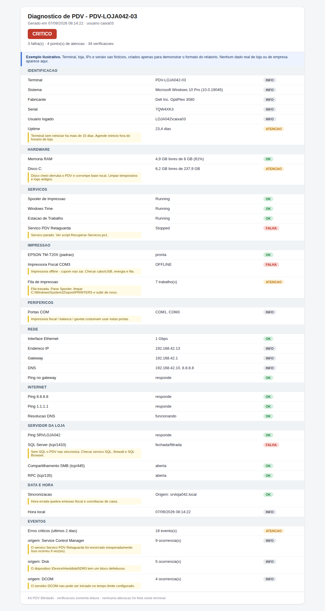

# Kit PDV Blindado

Ferramentas de diagnóstico e manutenção para terminais Windows de ponto de venda em ambiente de varejo.

Foi escrito por quem atende chamado de loja: o objetivo é **descobrir onde está o problema em minutos**, não produzir mais um relatório que ninguém lê. Tudo é somente leitura por padrão, roda sem instalar nada e não depende de internet.

**[→ Veja um relatório de exemplo](docs/exemplo-relatorio.html)** · **[→ Runbook de PDV parado](docs/RUNBOOK.md)** · [English](README.en.md)



*Relatório gerado por `Diagnostico-PDV.ps1`. Dados do exemplo são fictícios.*

---

## O que tem aqui

| Arquivo | O que faz | Altera algo? |
|---|---|---|
| [`scripts/Diagnostico-PDV.ps1`](scripts/Diagnostico-PDV.ps1) | Diagnóstico completo do terminal com relatório HTML e semáforo | Não |
| [`scripts/Teste-Rapido-Loja.bat`](scripts/Teste-Rapido-Loja.bat) | Teste que o pessoal da loja roda sozinho antes de abrir chamado | Não |
| [`scripts/Coletar-Evidencias.ps1`](scripts/Coletar-Evidencias.ps1) | Empacota evidências num `.zip` para anexar no chamado | Não |
| [`scripts/Recuperar-Servicos.ps1`](scripts/Recuperar-Servicos.ps1) | Sobe serviços parados, com confirmação digitada e log de rollback | **Sim** — pede confirmação |
| [`sql/Checkup-Loja.sql`](sql/Checkup-Loja.sql) | 7 checagens no SQL Server da loja: backup, bloqueio, jobs, índices | Não |
| [`docs/RUNBOOK.md`](docs/RUNBOOK.md) | Ordem de eliminação para PDV parado | — |

## O que o diagnóstico verifica

Identificação e uptime · memória e espaço em disco · serviços críticos · impressoras, fila de impressão e portas COM (impressora fiscal, balança, gaveta) · interface de rede, IP, gateway e DNS · internet · alcance do servidor da loja nas portas 1433 / 445 / 135 · sincronismo de hora · eventos críticos dos últimos dias, agrupados por origem.

O resultado sai num HTML com veredito **SAUDÁVEL / ATENÇÃO / CRÍTICO** e, em cada item que falhou, a orientação do que fazer a seguir.

## Começando

```powershell
# Liberar execução apenas nesta sessão
Set-ExecutionPolicy -Scope Process -ExecutionPolicy Bypass

# Diagnóstico do terminal
.\scripts\Diagnostico-PDV.ps1 -ServidorLoja 192.168.0.10

# Informando os serviços do seu PDV
.\scripts\Diagnostico-PDV.ps1 -ServidorLoja SRVLOJA01 `
    -ServicosCriticos "Spooler","W32Time","<servico-do-seu-pdv>"
```

O relatório abre sozinho e fica na área de trabalho.

Para descobrir o nome exato do serviço do seu PDV:

```powershell
Get-Service | Where-Object DisplayName -like "*<nome do sistema>*"
```

## Agendar o diagnóstico diário

```powershell
$acao    = New-ScheduledTaskAction -Execute "powershell.exe" `
           -Argument '-NoProfile -ExecutionPolicy Bypass -File "C:\KitPDV\Diagnostico-PDV.ps1" -ServidorLoja 192.168.0.10 -Saida "\\servidor\diagnosticos"'
$gatilho = New-ScheduledTaskTrigger -Daily -At 7:00am
Register-ScheduledTask -TaskName "KitPDV-Diagnostico" -Action $acao -Trigger $gatilho -RunLevel Highest
```

## Requisitos

- Windows 10/11 ou Windows Server
- PowerShell 5.1 (já vem no Windows) ou superior
- `Recuperar-Servicos.ps1` precisa ser executado como Administrador
- Sem dependências externas, sem instalação, sem acesso à internet

## Segurança

- Todos os scripts, exceto `Recuperar-Servicos.ps1`, são **somente leitura**
- Nenhum script coleta senha, dado de cartão ou dado de venda
- `Recuperar-Servicos.ps1` exige confirmação digitada, suporta `-WhatIf` e grava o estado anterior de cada serviço em `C:\ProgramData\KitPDV\logs`
- Os scripts são texto puro — leia antes de rodar em produção. É o que se deve fazer com qualquer script baixado da internet.

## Antes de usar em produção

Teste em **um** terminal fora do horário de pico. Confirme o nome do serviço do seu PDV antes de colocá-lo em `-ServicosCriticos`.

E a regra que vale mais que qualquer script aqui: **nunca** rode rebuild de índice, CHECKDB pesado ou reinício de SQL em horário de loja.

## Licença

MIT — veja [LICENSE](LICENSE).
